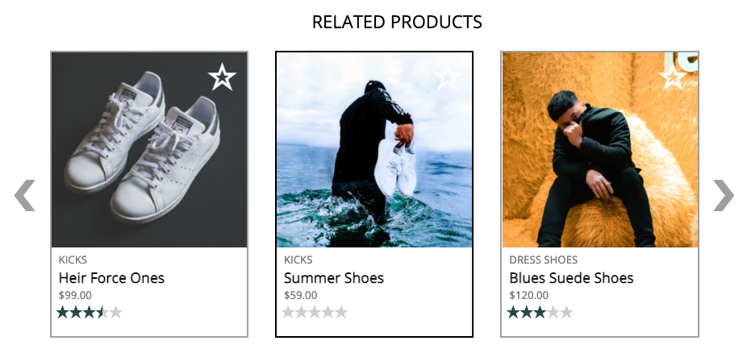
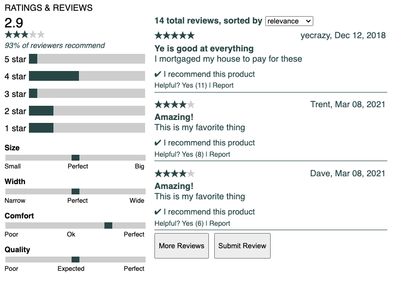
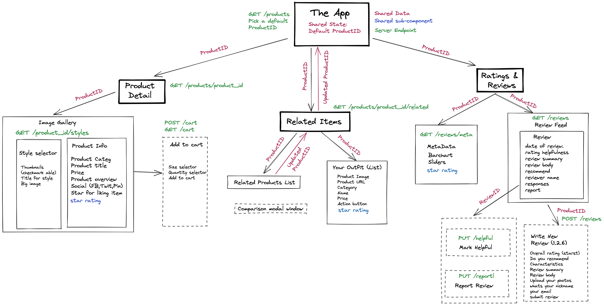

<h1 align="center" style="font-size: 2.7rem;">Aloe</h1>

<h2 align="center" style="font-size: 1.5rem;">An e-commerce retail store front  

## Table of Contents

1. [**Product Overview:**](#product-overview) Shows relevant overview information for a single product in the catalogue

2. [**Related Products:**](#related-products) Displays two sets of related products

3. [**Ratings and Reviews:**](#ratings-and-reviews) Displays the reviews and ratings of previous buyers

## Tech/framework used

**Built With**
- Javascript
- Node.js
- Express
- React

## Product Overview
This widget will show relevant information for a single product in the catalogue. Page should be uniform - every product rendered in same fashion.

**Features**
1. Product Information: General information about the product , including Star rating (based on reviews)including a hyperlink to direct viewer to rating & review widget.
2. Style Selector: Present all styles of product, with ability to toggle through
  * Each style should appear as a thumbnail, active style rendering checkmark &style name .Each product will have at least one style, only one style to beselected at a time.
3. Add to Cart: Selecting size and quantity to add to cart. Only if both are selected should youhave the ability to add to cart.
  * Only sizes in stock should have a drop down ability, with a limit of 15. Sizes un-available should not appear in list - dropdown should become inactive andread OUT OF STOCK. Dropdown for quantity of currentlystyle should be capped - If there are 5 items in stock, 5 care selectable. If 30 are in stock, only 15 are selectable.
4. Image Gallery: Default image will be a single main image, overlaid by thumbnails.
  *  Clicking on any thumbnail should render to the main image. Up to 7 thumbnails shouldbe displayed,  with the ability to expand the thumbnails view by scrollthrough them.
  * If a user hovers over themain image you should see a magnifying glass, if the user clicks an ex-panded view should appear, it should overlay the rest of the page. Theportion clicked should zoom by 2.5 times.

**Challenges and Tradeoffs**
* Beginning this widget was overwhelming initially - once I drew mycomponent structure and envisioned my state data flow I started the feature I thought was more visually impactful - the Carosel. Once I implemented it’s functionality I started the style selector, which was very challenging and posed a lot of issues rendering inconjunction with the Carosel. After a lot of work and some con-versations I realized my state flow was not ideal and after two different implementations I got it working. This took a lot of my time figuring it out and refactoring - however after making these changes it was much easier to implement my style selector.
* When we were polishing the app for presentation a team mate pointed out that product details stayed static with clicks - had to research and successfully utilize componentDidUpdate which wasa cool experience.
* Also after speaking with teammates it was de-cided that I take over CSS styling which was challenging - getting divs to fit within each other and layering them correctly to imple-ment my design was difficult  but a fantastic experience and I en-joyed the visual payoff every time I completed something to my liking.
* I designed a modern, simple aesthetic- It was really impor-tant that upon presentation this has the look and feel of a retail site - something familiar. I also created a header and footer for future implementation. I didn’t modify too much of my team mate’s styling because I wanted their work to shine, I centered allour widgets to align and the site has a maximum width.

## Related Products
The Related Items & Comparison module will display two sets of related products.  The first set will be a list of products, determined internally, that are related to the product currently being viewed.  The second set will be a list, custom created by the user, of products which the user has grouped with the current product into an ‘outfit’.
This widget interacts with the app state the most out of all the components- it changes the whole page’s product, pulls data from cookies, makes a heck of a lot of API requests.

**Features**
1. Custom ‘carousel’ list behavior
  * Each list shows 3 items at once, if there are more items they ‘overflow’ off the viewport and can be accessed by clicking directional arrows to bring them into view.
2. ‘Card’ component
  * Displays product data and is shared between the two lists (Related Items & Comparison)
3. Clicking
  * Clicking on an action button from Related Items will bring up a comparison modal that compares features of the current product and the related product
  * Clicking on the ‘+’ icon in My Outfit will add the current product to the outfit. This outfit list is stored in cookies and will persist on refresh or page revisit

**Challenges and Tradeoffs**
* The API we used was structured in a way that made it necessary to make 3 requests per card: one for product image, one for features, and one for ratings. This meant that this widget was constantly skirting the line to a 429 error (too many requests). To solve this, I implemented a caching function that intercepts outgoing requests and returns a cached response if an identical request was made previously.
* Chose to make the Card component a stateful class component rather than a functional component with hooks in order to get a working demo. The challenge is always deciding between a fast, functional Minimum Viable Product and accumulating technical debt, or an efficient long-term solution that may require more upfront technical investment but less future maintenance.
* ‘Carousel’ list behavior was first implemented by re-rendering each of the 3 cards each time a directional button was clicked. This sent out an additional 3 API requests per card and is not optimal for load times. This was later refactored to a horizontally scrolling viewport that rendered all cards upfront (though some may be out of view initially). This meant longer initial load time but more seamless user experience after.

## Ratings and Reviews
This is the ratings and reviews component of an e-commerce storefront. Customers can view prior reviews and also post their own.

**Features**

* Built bar charts and sliders to improve data visualization
* Created a star rating system
* Translated and rendered review data from black box API
* Created a modal to contain form information, which users can post

**Challenges and Tradeoffs**
* Ambiguous API documentation
    * Required testing endpoints with Postman to work out bugs
* Styling:
    * Choice between pre-existing libraries (such as C3.js) vs implementing from scratch in CSS
* State and prop management
    * Needed to ensure that reviews would update whenever a new product item was clicked. Used React's 'componentDidUpdate()' lifecycle method to achieve this.

 <!--  -->
 <!--  -->
 <!--  -->

## Data Integration and Component Organization

  * API and Data Retrieval: the Related Products widget is the most 'expensive' in terms of interactions with an external API. However, all 3 components make API calls, which led to some performance challenges. We attempted to solve the issue with caching.
  * State management: We did not use a state manager. Instead, the Related Products widget sets a product ID on our top level App component, which then 'drills' down the selected product ID as a property

## Build Project
Follow these steps to run the project:
- Clone down the repo in the terminal
  * `git clone https://github.com/TN423/Catwalk.git`
- Add personal github token
  * Go to the exampleConfig.js file and rename to config.js
  * Replace `UPDATE ME` with github key into config.js
- Install dependencies - `npm install`
- Run webpack - `npm run build-dev`
- Run server - `npm run server-dev`
- Run Sass styling - `npm run sass-dev`

## Developers

<table>
  <tr>
    <td align="center"><a href="https://github.com/swizzlestix09"> <b>Angely Rodriguez</b></a </td>
    <td align="center"><a href="https://github.com/7u1ian"> <b>Jason Chen</b></a> </td>
    <td align="center"><a href="https://github.com/TN423"> <b>Justin Hurst</b></a> </td>

  </tr>
</table>
